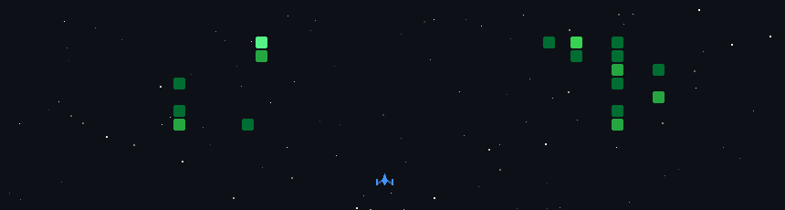

<!-- ========================================================= -->
<!--                 GitHub Profile README                     -->
<!-- ========================================================= -->

<h1 align="center">Hi, I'm Shrinu Varshney 👋</h1>

<h3 align="center">Generative AI Developer (Fresher) &nbsp;|&nbsp; Building RAG systems & AI-powered apps</h3>

<p align="center">

</p>

<p align="center">
<a href="https://www.linkedin.com/in/shrinuvarshney"></a>
<a href="mailto:shrinuvarshney30@gmail.com"></a>

</p>

---

### 👋 About Me

I like building things with LLMs and figuring out how they actually work under the hood.

- 🔭 Into **RAG systems** and AI-powered apps
- 🌱 Always learning something new — right now it's agents & system design
- ⚡ Fun fact: I'd rather debug a retrieval pipeline than watch Netflix

---

### 🛠 Featured Projects

**🔍 RAG-Based Chatbot**
My primary interview project — a retrieval-augmented generation chatbot built to demonstrate real systems-design judgment: chunking strategy, retrieval quality, and grounding LLM responses in source documents rather than hallucinating.

**🗃️ Text-to-SQL Query Generator**
Converts natural language questions into SQL queries against an e-commerce database. Built with the **Claude API** for generation, a **FastAPI** backend, a **Streamlit** UI, **SQLite** for storage, and `sqlparse` for query validation.

**📋 AI Job Application Assistant**
A semi-automated job-search tool that parses a resume, pulls listings from the **Adzuna** and **RemoteOK** APIs, and ranks them with a two-stage pipeline (local embeddings shortlist → LLM fit scoring). Automates form-filling on Greenhouse/Lever with **Playwright** — but every submission passes through a hard-coded human-confirmation gate; nothing goes out unreviewed.

---

### 💻 Tech Stack

**Languages**
<p>

</p>

**Generative AI / ML**
<p>


</p>

**Backend & Data**
<p>

</p>

**Tools & Cloud**
<p>

</p>

---

### 🚀 My Contribution Graph, Gamified

<p align="center">

</p>

> Turns my contribution graph into a Galaga-style space shooter — each commit becomes an enemy ship. Powered by [gh-space-shooter](https://github.com/czl9707/gh-space-shooter), auto-updated daily via GitHub Actions.

<details>
<summary>⚙️ How it's set up</summary>

Add this workflow to your profile repo at <code>.github/workflows/update-game.yml</code>:

```yaml
name: Update Space Shooter Game

on:
  schedule:
    - cron: '0 0 * * *'  # daily at midnight UTC
  workflow_dispatch:

permissions:
  contents: write

jobs:
  update-game:
    runs-on: ubuntu-latest
    steps:
      - uses: actions/checkout@v6
        with:
          fetch-depth: 2  # required

      - uses: czl9707/gh-space-shooter@v2
        with:
          github-token: ${{ secrets.GITHUB_TOKEN }}
          output-path: 'game.gif'
          strategy: 'random'
```

The action commits `game.gif` back to the repo, which is what `./game.gif` above points to — no manual regeneration needed.
</details>

---

### 📈 GitHub Activity

<p align="center">

</p>

<p align="center">


</p>

---

<p align="center"><i>Learn → Build → Ship → Repeat</i></p>
